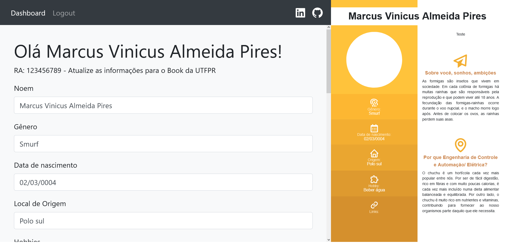
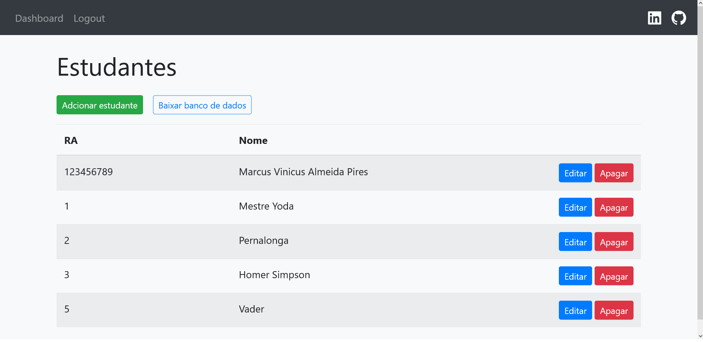

# Formulério para o BOOK da UTFPR 2022

Formulário para coletar os dados dos alunos da UTFPR. Apresentando um preview da pagina do book, com sistema de autenticação de usuários.


## Rodando localmente

Clone o projeto mais recente

```bash
  git clone https://github.com/M4rcusVinicius/book-develop-tests
```

Entre no diretório do projeto

```bash
  cd book-develop-tests
```

Instale as dependências

```bash
  npm install
```

Inicie o servidor

```bash
  npm run dev
```


## Demonstração




## Referência

 - [Next js](https://nextjs.org/)
 - [Styled Components](https://styled-components.com/)
 - [Vercel](https://vercel.com)

### Template (Fork)

 - Desenvolvedor: [cornflourblue](https://github.com/cornflourblue)
 - Projeto: [next-js-11-registration-login-example](https://github.com/cornflourblue/next-js-11-registration-login-example)

## Autores

- [@M4rcusVinicius](https://github.com/M4rcusVinicius)

